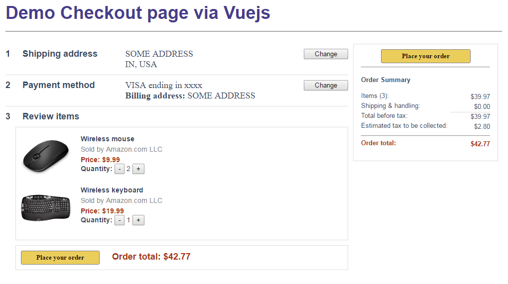

# vuejs-learning
Mini examples of [Vuejs](https://vuejs.org/v2/guide/index.html), such as Amazon checkout page, and Countdown Timer.

### Demo of Amazon Checkout Page
1. The `Billing address` will update with `Shipping address`.
2. The `Order total` and `tax` will update with the change of each item's `Quantity`. 

Live demo: [Vue.js Example: Amazon Checkout Page](https://gaopinghuang0.github.io/2018/05/17/vuejs-amazon-checkout-demo)

Screenshot:
<kbd>

</kbd>

### Demo of Countdown Timer
.

Code is in `./countdown-timer-example/`
