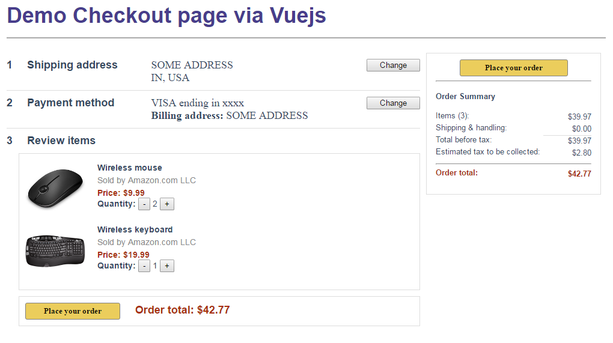

# vuejs-learning
Mini examples of vuejs. See [official guide](https://vuejs.org/v2/guide/index.html)

## Run
```bash
python -m SimpleHTTPServer   
# OR if npm is installed
npm start

# Then open browser and go to http://localhost:8000
```

## Development
Open a new tab that is different from the above one for Run
```bash
npm install  # install all dependency modules

# use Grunt to auto reload once file changes
# there are two ways to run Grunt
# 1. install grunt command line tool globally if has root access
npm install grunt-cli -g
grunt

# 2. run local grunt
./node_modules/.bin/grunt

# Then add this script to each html file that needs auto-reloading
<script src="//localhost:35729/livereload.js"></script>
```

## Screenshot of ./examples/comprehensive-example


## ~~Webpack~~
~~See [beginner guide](https://www.sitepoint.com/beginners-guide-to-webpack-2-and-module-bundling/)~~

